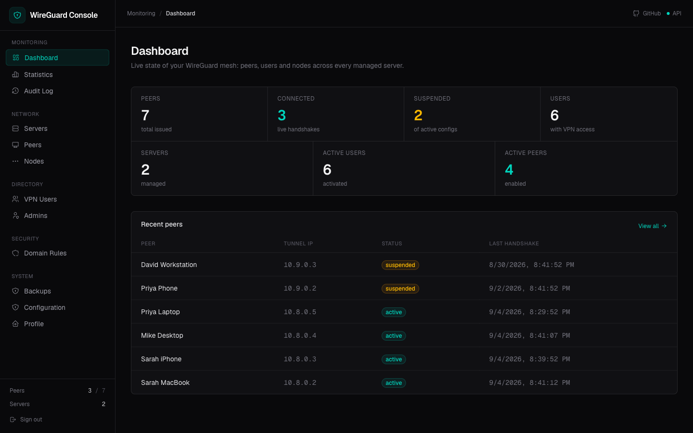
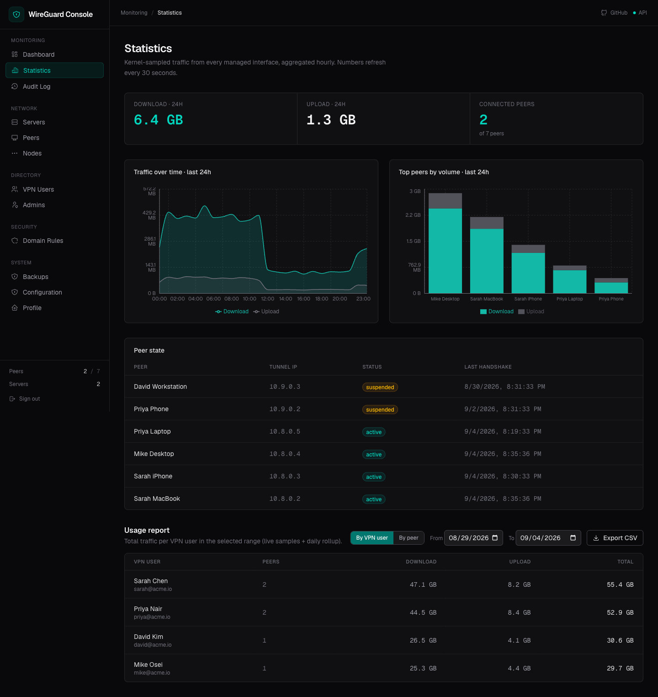
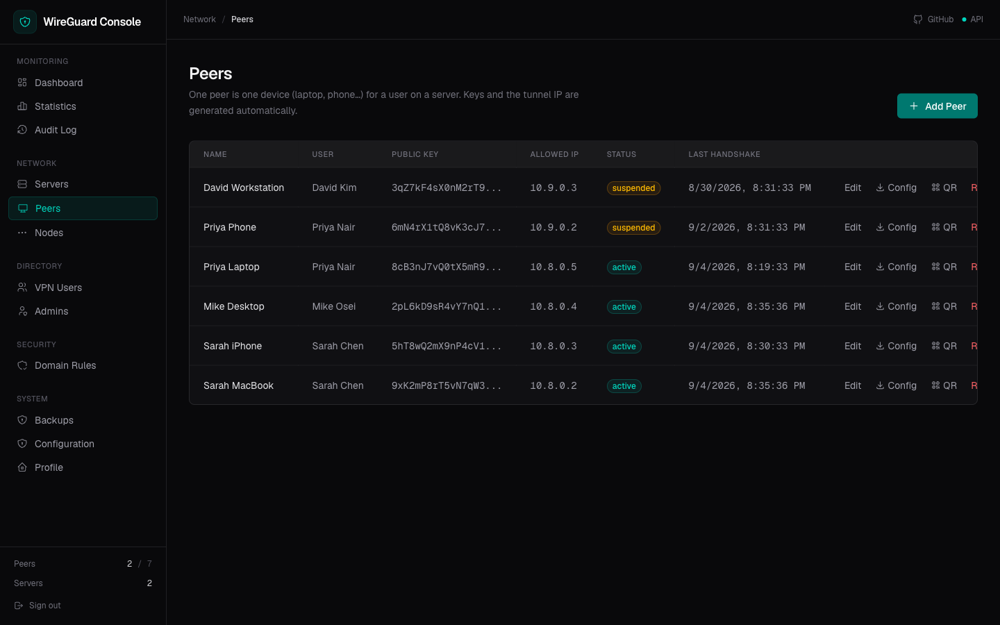
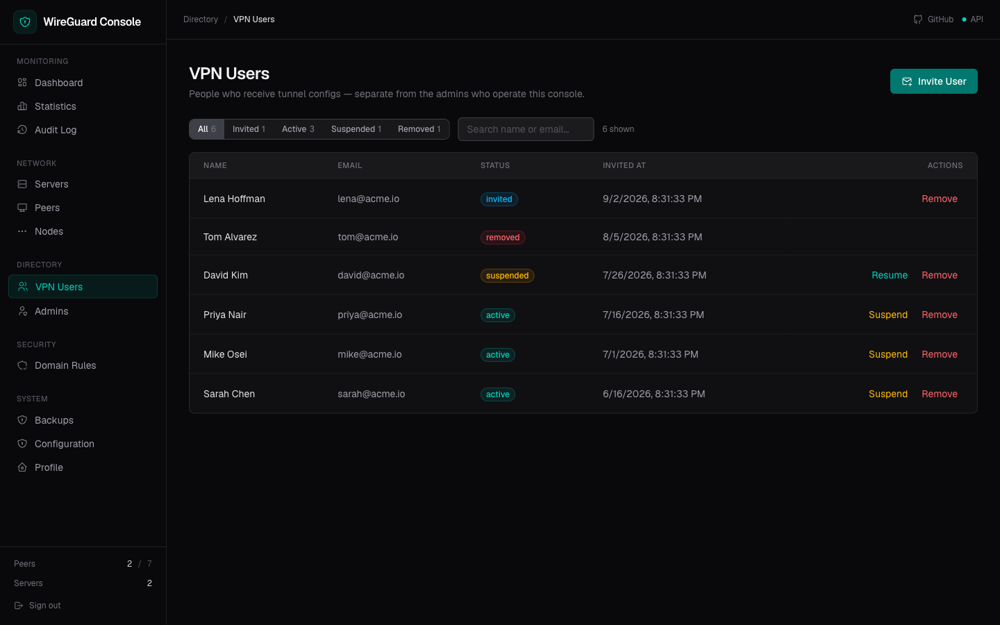

# WireGuard Console

A self-hosted web console for issuing, monitoring, and revoking company WireGuard VPN access — one console, many VPN exit servers across regions.

## Screens

<table>
  <tr>
    <td align="center" width="50%">
      
      <br /><em>Dashboard — live KPIs and recent peers</em>
    </td>
    <td align="center" width="50%">
      
      <br /><em>Statistics — traffic chart, top peers and usage report</em>
    </td>
  </tr>
  <tr>
    <td align="center" width="50%">
      
      <br /><em>Peers — active/suspended devices, config &amp; QR actions</em>
    </td>
    <td align="center" width="50%">
      
      <br /><em>VPN Users — status tabs, search and invite</em>
    </td>
  </tr>
</table>

## What you get

- **Admins** (invited, mandatory 2FA) manage everything from the web UI
- **VPN users** claim their own peer config via an emailed invite link
- **Distributed nodes** — add VPN exit machines in any region in ~2 minutes
- **DNS filtering** — global and per-user domain blocking (AdGuard) with a branded block page
- **Web activity** — per-user browsing history, traffic charts and usage reports (CSV export)
- **Backup & restore** — one-click, 2FA-gated

## Quick start

Requires: Ubuntu 22.04+, Docker (installed automatically), and either a **domain** (recommended) or a public IP.

```bash
curl -fsSL https://raw.githubusercontent.com/garyhooi/wireguard-console/main/install.sh | sudo bash
```

This installs Docker, WireGuard tools and the stack, provisions AdGuard Home, opens the firewall (ufw), and **prints your first `super_admin` email + password at the end** — save them, log in, change the password and enroll 2FA.

**No domain?** Enter the server's public IP when prompted. HTTPS then uses Caddy's internal CA — your browser shows a one-time self-signed warning (the connection is still encrypted). For a trusted certificate without buying a domain, use `CONSOLE_DOMAIN=<your-ip>.sslip.io bash install.sh`.

**Behind Cloudflare?** If the console is fronted by Cloudflare with the SSL/TLS mode set to **Flexible** (or "Automatic SSL/TLS" resolving to Flexible — Cloudflare reaches your server over plain HTTP), set `WGCONSOLE_TLS=external-proxy`:

```bash
CONSOLE_DOMAIN=vpn.example.com WGCONSOLE_TLS=external-proxy bash install.sh
```

In that mode Caddy serves plain HTTP only (Cloudflare terminates HTTPS at its edge) and — crucially — **does not redirect HTTP→HTTPS**. Without this, Caddy answers Cloudflare's plain-HTTP origin fetch with `308 → https://…`, Cloudflare forwards it, and the browser loops with `ERR_TOO_MANY_REDIRECTS`. Cloudflare's own proxy IP ranges are trusted for `X-Forwarded-*` headers so the API still sees the original client IP and scheme. Cloudflare reaches your server on **port 80 only** (Flexible mode can't reach an HTTPS origin, and the console is deliberately not served on 443 in this mode). If you can use Cloudflare **Full** instead, just leave `WGCONSOLE_TLS` empty — Caddy's own certificate then serves the origin over 443.

To add more operators: **System → Admins → Invite Admin**. Add VPN users under **Directory → VPN Users**, then issue peers to them.

## Firewall — which ports to open

Only **three inbound rules** matter on a console host:

| Port | Purpose | Open? |
|---|---|---|
| `80/tcp` | Caddy: HTTPS certificate issuance + block page | ✅ |
| `443/tcp` | Console web UI + API | ✅ |
| `51820/udp` | WireGuard (use your custom port if you changed it) | ✅ only if this machine also runs a VPN server |

The installer does this automatically when ufw is active. On a cloud firewall (AWS/Azure/DigitalOcean security group), add the same three rules manually.

**Leave closed (bound but internal — do not expose):**

- `53/udp+tcp` — AdGuard DNS. Tunnel peers reach it through the VPN gateway, never from the internet. Opening it makes your server an open DNS resolver.
- `3000/tcp` — AdGuard admin UI. The console reaches it internally.

## Distributed nodes (one console, many regions)

A **node** is a machine in another location (e.g. Singapore, Thailand) that runs a tiny agent. After a one-time SSH to install it, the agent **connects out** to your console and polls for changes every 15s — no inbound ports (except WireGuard) and no further SSH needed. You can host the console on one machine and still manage exits everywhere.

### Step-by-step

1. **Install the console** on your main server (see Quick start). Every machine in the stack that runs WireGuard needs a VPN *server* entry and a unique subnet — e.g. `10.8.0.0/24` for the console host, `10.9.0.0/24` for Singapore, `10.10.0.0/24` for Thailand. Never reuse a subnet on two locations.

2. **Register the node** — Console → **Nodes → Add Node**:
   - **Name** — e.g. `Singapore Exit`
   - **Location** — free text, e.g. `SG, ap-southeast-1`
   - Click **Create Node**. The console generates a token and shows a **join command — copy it now** (the token is shown only once).

3. **Run the join command on the node machine** (SSH in, paste, run with sudo). It installs Docker if needed, builds the agent, and starts it:
   ```bash
   curl -fsSL https://raw.githubusercontent.com/garyhooi/wireguard-console/main/node-install.sh | sudo bash -s -- <TOKEN> https://<your-console-domain> <NODE_ID>
   ```

4. **Open the WireGuard port on the node** — the node installer does not touch its firewall:
   ```bash
   sudo ufw allow 51820/udp    # or your custom WireGuard port
   ```
   Outbound needs nothing: the agent only polls your console over HTTPS (443).

5. **Create the VPN server on that node** — Console → **Servers → Add Server**:
   - **Name** — the location, e.g. `Singapore VPN`
   - **Public endpoint** — the node machine's public IP + port, e.g. `203.0.113.10:51820` (this is what peers connect to)
   - **Managed by** → `Node (agent applies it automatically)`
   - **Node** → pick `Singapore Exit`
   - **Network** → a subnet unique to this location, e.g. `10.9.0.0/24`
   - **DNS servers** → set a public resolver (e.g. `1.1.1.1, 8.8.8.8`). Nodes have no AdGuard, and leaving this empty defaults peers to the tunnel gateway, where no DNS server listens — clients then can't resolve anything.

6. **Wait ~30s and verify.** The console shows the node green/"ok" with a server count; on the node machine `sudo wg show` lists the interface. Add a peer to that server and connect from a device to test the exit.

Repeat steps 2–6 for each location. Deleting a node is safe — its servers fall back to *manual* mode.

> **Note:** remote-node servers currently don't report traffic stats or DNS/web activity — those features track the console host's own AdGuard. Nodes also self-heal after a reboot: the agent re-applies interfaces on its next poll.

## Backup & restore

**System → Backups**: create, download (off-server copy), and restore with one click. Destructive actions ask for your 2FA code. Backups live on the console's Docker volume — download them regularly.

## Upgrading

Re-run the same install command — it updates the code and keeps all admins, peers, and data.

## Development

```bash
# Backend (Go)         # Frontend (React/Vite)
cd backend             cd frontend
go run ./cmd/api       bun install && bun run dev
```

Full test suite: `scripts/test.sh`. Manual setup (no installer): `cp .env.example .env`, fill in `CONSOLE_DOMAIN` + secrets, `docker compose up -d --build`.

## License & docs

[Apache 2.0](LICENSE) · Detailed architecture/API docs in [`plan/WIREGUARD CONSOLE BUILD GUIDE.md`](plan/WIREGUARD%20CONSOLE%20BUILD%20GUIDE.md).
