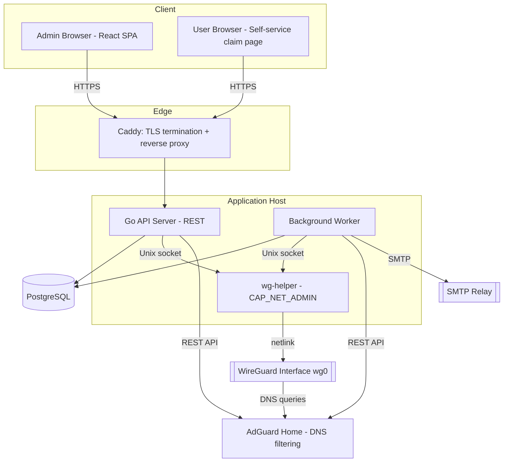

# WireGuard Management Console

**Planning & Implementation Guide — internal company VPN admin platform**
Status: Planning draft v1 · 2026-07-19

A self-hosted, production-grade web console for issuing, monitoring, and revoking company WireGuard VPN access — replacing manual `wg`/`wg-quick` file editing with an auditable, multi-admin system.

---

## Contents

1. [Overview & Goals](#1-overview--goals)
2. [Tech Stack](#2-tech-stack)
3. [System Architecture](#3-system-architecture)
4. [Data Model](#4-data-model)
5. [Module Specifications](#5-module-specifications)
6. [Authentication, Multi-Admin & 2FA](#6-authentication-multi-admin--2fa)
7. [Domain Blocking — Global & User-Level](#7-domain-blocking--global--user-level)
8. [Email System](#8-email-system)
9. [API Reference](#9-api-reference)
10. [Frontend Architecture & GUI](#10-frontend-architecture--gui)
11. [Security Hardening Checklist](#11-security-hardening-checklist)
12. [Deployment Architecture](#12-deployment-architecture)
13. [Implementation Roadmap](#13-implementation-roadmap)
14. [Open Questions](#14-open-questions)

---

## 1. Overview & Goals

**What this is:** a hub-and-spoke WireGuard deployment (one or more company-run WG servers; employee devices as peers) with a web console in front of it. The console is the only thing admins touch — nobody hand-edits `wg0.conf` again.

**Goals**
- Multiple named admin accounts with mandatory 2FA — no shared credentials, full audit trail.
- Self-service-ish onboarding: admin invites a user by email, user claims their own peer.
- Suspend/resume/remove peers in one click, with the change taking effect on the live interface immediately.
- Per-peer and per-user traffic visibility.
- Company-wide and per-user domain blocking (content/security policy), enforced at the DNS layer with anti-bypass hardening.
- Everything an admin does is logged, immutably.

**Non-goals for v1** (call these out explicitly so scope doesn't creep):
- Not a mesh/NAT-traversal platform like Tailscale/Headscale/Netbird — peers talk to the server, not to each other, unless you explicitly open that up later.
- No SSO/SAML on day one (flagged as a Phase 2+ item in §14).
- No multi-tenant/billing — single organization.

**Requirements coverage** — where each of your asks is addressed:

| Requirement | Section |
|---|---|
| 1. Multiple admin login | §6 |
| 2. 2FA setup | §6 |
| 3. Peer management incl. suspend/remove | §5.2 |
| 4. Traffic usage per profile | §5.7 |
| 5. Email invite | §5.3, §8 |
| Dashboard | §5.1 |
| Peer Management | §5.2 |
| User Management | §5.3 |
| Server Management | §5.4 |
| Configuration | §5.5 |
| QR Code | §5.6 |
| Statistics | §5.7 |
| Audit Log | §5.8 |
| Domain blocking (global + user) | §7 |

---

## 2. Tech Stack

Frontend is fixed by your spec. Everything else below is a recommendation with reasoning — treat it as a starting position, not a mandate.

| Layer | Choice | Why |
|---|---|---|
| Frontend framework | React 19 + TypeScript + Vite | As specified |
| Routing | TanStack Router (file-based) | As specified — type-safe params, `beforeLoad` guards, loader→Query integration |
| Server state | TanStack Query v5 | As specified |
| Tables | TanStack Table | Same ecosystem; needed for Peers/Users/Audit Log grids |
| UI kit | Tailwind CSS + shadcn/ui | Low-risk, unopinionated primitives you own the code for — no black-box component library to fight |
| Forms/validation | React Hook Form + Zod | Zod schemas double as your API request validators if you share types |
| Charts | Recharts | Well-established, React-native API, sufficient for traffic time-series |
| QR codes | `qrcode` (client-side, from config text) | No server round-trip needed to render one |
| Package manager | Bun | — |
| **Backend API** | **Go 1.23+**, `chi` router | See reasoning below |
| WireGuard control | `wgctrl-go` (`golang.zx2c4.com/wireguard/wgctrl`) | The WireGuard project's own Go bindings — netlink-based, no shelling out |
| DB access | `sqlc` + `golang-migrate` | Typed SQL from hand-written queries, no ORM magic, plain migration files |
| 2FA | `pquerna/otp` | TOTP (RFC 6238), QR provisioning URIs, standard in the Go ecosystem |
| Password hashing | Argon2id (`golang.org/x/crypto/argon2`) | Current OWASP-recommended KDF |
| Secrets-at-rest | AES-256-GCM (stdlib `crypto/aes`) | Same primitive you're already using elsewhere |
| Email | `wneessen/go-mail` | Modern Go SMTP client, connection pooling, no cgo |
| Database | PostgreSQL 16+ | Relational integrity for users/peers/audit trail |
| Sessions/queue | PostgreSQL (see note) | Redis is optional, not required — see below |
| DNS filtering | AdGuard Home | Self-hosted, open-source, REST API, native per-client rule syntax — see §7 |
| Reverse proxy | Caddy | Automatic HTTPS, minimal config |
| Deployment | Docker Compose | Single host is enough for an internal tool |

**Why Go for the backend, given your frontend is TypeScript:** `wgctrl-go` is maintained under the WireGuard project's own namespace and talks to the kernel over netlink directly — it's the same category of approach used by wireguard-ui, Netmaker, and Headscale, and it avoids shelling out to the `wg` CLI (which is what wg-easy does, and which requires more careful input-escaping and error handling on every call). A Node/TypeScript backend shelling out to `wg`/`wg-quick` is a legitimate, lower-effort alternative if you'd rather stay in one language end-to-end — flagging it here as the explicit tradeoff rather than silently picking one for you. Given you already reach for Rust when a job wants a systems-level tool (the localhost autofill server in SoloPass), a Go binary alongside a TypeScript frontend isn't a new kind of split for you, just a different language for the same role.

**Why Postgres-only instead of Postgres+Redis:** sessions can live in a `sessions` table (indexed on token hash, cleaned up by a cron job), rate-limiting can use a small counters table or even in-process memory for a single backend instance, and a background job queue can use `SELECT ... FOR UPDATE SKIP LOCKED` against a `jobs` table — a well-established Postgres pattern. For the scale an internal company tool actually runs at, this is one fewer service to deploy, patch, and back up. If you outgrow it (multiple backend replicas needing shared rate-limit state, high email volume), Redis is a clean drop-in later — noted as a Phase 2+ option, not a v1 dependency.

**Why wgctrl-go specifically:** it configures an *existing* WireGuard device (keys, peers, listen port) over netlink — it does **not** create the interface or assign it an IP. That first step (`ip link add wg0 type wireguard`, `ip addr add 10.10.0.1/24 dev wg0`) happens once, at boot, via a small systemd unit or a one-time `wg-quick up` on a minimal base config. After that, wgctrl-go owns all peer add/remove/suspend operations against the already-running interface — you never call `wg-quick` again after first boot.

---

## 3. System Architecture



### Privilege separation (the one decision that matters most for "production ready")

Manipulating a WireGuard interface requires `CAP_NET_ADMIN`. The web-facing API server — the thing parsing untrusted HTTP requests, running your auth logic, talking to the database — should **never** hold that capability or run as root. If it's ever compromised via a dependency vuln or an auth bug, the blast radius should stop at "can read the database," not "can rewrite the company VPN's routing."

Concretely:
- `wg-helper` is a small, deliberately dumb Go binary. Its only job is: accept a request over a Unix domain socket (mode `0700`, owned by a dedicated group), validate it against a narrow schema (add peer, remove peer, sync peer set, read transfer stats), and call `wgctrl-go`. It holds `CAP_NET_ADMIN` via `setcap cap_net_admin+ep /usr/local/bin/wg-helper` (preferred over running it as root) or via a systemd unit with `AmbientCapabilities=CAP_NET_ADMIN`.
- The API server and background worker run as an unprivileged `wgconsole` user, in the group that can reach the socket, and hold no special capabilities at all.
- The Postgres role the app connects as should not have `DROP`/`TRUNCATE` grants, and should have `INSERT`/`SELECT`-only access to `audit_logs` (no `UPDATE`/`DELETE`) so a compromised app process can't rewrite its own audit trail.

### Reconciling desired state to the kernel

Postgres is the source of truth for what peers *should* exist and be active. On every mutation (peer created/suspended/resumed/removed), the API computes the full desired peer set for that server and pushes it to `wg-helper`, which calls:

```go
err := client.ConfigureDevice(ifaceName, wgtypes.Config{
    ReplacePeers: true,
    Peers:        desiredPeers, // only active peers for this server
})
```

`ReplacePeers: true` is the Go-native equivalent of `wg syncconf` — it atomically replaces the kernel's peer set with exactly what you send, without tearing down the interface or interrupting peers that didn't change. A suspended peer is simply left out of `desiredPeers`: no key rotation, no client-side reconfiguration, instantly reversible by resuming.

---

## 4. Data Model

```sql
-- Admins: the people who operate the console
CREATE TABLE admins (
    id                     UUID PRIMARY KEY DEFAULT gen_random_uuid(),
    email                  TEXT UNIQUE NOT NULL,
    password_hash          TEXT NOT NULL,            -- Argon2id
    role                   TEXT NOT NULL CHECK (role IN ('super_admin','admin','auditor')),
    totp_secret_encrypted  TEXT,                      -- AES-256-GCM, null until 2FA enrolled
    totp_enabled           BOOLEAN NOT NULL DEFAULT FALSE,
    backup_codes_hash      TEXT[],                    -- hashed, single-use
    status                 TEXT NOT NULL DEFAULT 'active' CHECK (status IN ('active','disabled')),
    failed_login_count     INT NOT NULL DEFAULT 0,
    locked_until           TIMESTAMPTZ,
    last_login_at          TIMESTAMPTZ,
    created_at             TIMESTAMPTZ NOT NULL DEFAULT now(),
    updated_at             TIMESTAMPTZ NOT NULL DEFAULT now()
);

CREATE TABLE admin_sessions (
    id           UUID PRIMARY KEY DEFAULT gen_random_uuid(),
    admin_id     UUID NOT NULL REFERENCES admins(id) ON DELETE CASCADE,
    token_hash   TEXT NOT NULL,                       -- opaque token, hashed at rest
    ip_address   INET,
    user_agent   TEXT,
    expires_at   TIMESTAMPTZ NOT NULL,
    created_at   TIMESTAMPTZ NOT NULL DEFAULT now()
);

-- Users: employees who get VPN access (not console operators)
CREATE TABLE users (
    id           UUID PRIMARY KEY DEFAULT gen_random_uuid(),
    email        TEXT UNIQUE NOT NULL,
    full_name    TEXT,
    status       TEXT NOT NULL DEFAULT 'invited' CHECK (status IN ('invited','active','suspended','removed')),
    invited_by   UUID REFERENCES admins(id),
    invited_at   TIMESTAMPTZ,
    activated_at TIMESTAMPTZ,
    created_at   TIMESTAMPTZ NOT NULL DEFAULT now(),
    updated_at   TIMESTAMPTZ NOT NULL DEFAULT now()
);

CREATE TABLE invites (
    id           UUID PRIMARY KEY DEFAULT gen_random_uuid(),
    user_id      UUID NOT NULL REFERENCES users(id) ON DELETE CASCADE,
    token_hash   TEXT NOT NULL,
    expires_at   TIMESTAMPTZ NOT NULL,
    accepted_at  TIMESTAMPTZ,
    created_at   TIMESTAMPTZ NOT NULL DEFAULT now()
);

-- Servers: WireGuard interfaces (usually one, can be several)
CREATE TABLE servers (
    id                          UUID PRIMARY KEY DEFAULT gen_random_uuid(),
    name                        TEXT NOT NULL,
    public_endpoint             TEXT NOT NULL,        -- host:port clients connect to
    listen_port                 INT NOT NULL,
    interface_name              TEXT NOT NULL,        -- e.g. wg0
    server_public_key           TEXT NOT NULL,
    server_private_key_encrypted TEXT NOT NULL,
    network_cidr                CIDR NOT NULL,        -- e.g. 10.10.0.0/24
    dns_servers                 TEXT[] NOT NULL,      -- pushed to clients; points at AdGuard Home
    default_allowed_ips         TEXT NOT NULL DEFAULT '0.0.0.0/0',
    mtu                         INT NOT NULL DEFAULT 1420,
    persistent_keepalive        INT NOT NULL DEFAULT 25,
    status                      TEXT NOT NULL DEFAULT 'active' CHECK (status IN ('active','disabled')),
    created_at                  TIMESTAMPTZ NOT NULL DEFAULT now()
);

-- Peers: individual WireGuard profiles (a user can have several — phone, laptop, ...)
CREATE TABLE peers (
    id                       UUID PRIMARY KEY DEFAULT gen_random_uuid(),
    user_id                  UUID NOT NULL REFERENCES users(id) ON DELETE CASCADE,
    server_id                UUID NOT NULL REFERENCES servers(id),
    name                     TEXT NOT NULL,           -- e.g. "Gary's iPhone"
    public_key               TEXT UNIQUE NOT NULL,
    private_key_encrypted    TEXT,                     -- null if client-side keygen was used; see §5.3
    preshared_key_encrypted  TEXT NOT NULL,             -- always generated server-side
    allowed_ip               INET NOT NULL,             -- assigned tunnel IP, e.g. 10.10.0.5/32
    status                   TEXT NOT NULL DEFAULT 'active' CHECK (status IN ('active','suspended','removed')),
    last_handshake_at        TIMESTAMPTZ,
    created_at                TIMESTAMPTZ NOT NULL DEFAULT now(),
    suspended_at               TIMESTAMPTZ,
    removed_at                 TIMESTAMPTZ,
    UNIQUE (server_id, allowed_ip)
);

-- Traffic time series (raw; rolled up and pruned by a nightly job past 30 days)
CREATE TABLE peer_traffic_samples (
    id          BIGSERIAL PRIMARY KEY,
    peer_id     UUID NOT NULL REFERENCES peers(id) ON DELETE CASCADE,
    rx_bytes    BIGINT NOT NULL,     -- delta since previous sample
    tx_bytes    BIGINT NOT NULL,
    sampled_at  TIMESTAMPTZ NOT NULL DEFAULT now()
);
CREATE INDEX ON peer_traffic_samples (peer_id, sampled_at);

-- Domain blocking rules
CREATE TABLE domain_block_rules (
    id          UUID PRIMARY KEY DEFAULT gen_random_uuid(),
    scope       TEXT NOT NULL CHECK (scope IN ('global','user')),
    user_id     UUID REFERENCES users(id) ON DELETE CASCADE,  -- null when scope = 'global'
    domain      TEXT NOT NULL,        -- e.g. "example.com" — subdomains blocked automatically, see §7
    created_by  UUID REFERENCES admins(id),
    created_at  TIMESTAMPTZ NOT NULL DEFAULT now(),
    CHECK ((scope = 'global' AND user_id IS NULL) OR (scope = 'user' AND user_id IS NOT NULL))
);

-- Audit log: append-only
CREATE TABLE audit_logs (
    id               BIGSERIAL PRIMARY KEY,
    actor_admin_id   UUID REFERENCES admins(id),
    action           TEXT NOT NULL,        -- e.g. 'peer.suspend', 'admin.login_failed'
    target_type      TEXT,                 -- 'peer' | 'user' | 'admin' | 'server' | 'domain_rule' | 'config'
    target_id        TEXT,
    metadata         JSONB,                -- before/after values, extra context
    ip_address       INET,
    created_at       TIMESTAMPTZ NOT NULL DEFAULT now()
);
CREATE INDEX ON audit_logs (created_at DESC);
CREATE INDEX ON audit_logs (actor_admin_id);

-- Background jobs (email queue etc.) — Postgres-as-queue via SKIP LOCKED
CREATE TABLE jobs (
    id           BIGSERIAL PRIMARY KEY,
    kind         TEXT NOT NULL,           -- 'send_email'
    payload      JSONB NOT NULL,
    attempts     INT NOT NULL DEFAULT 0,
    run_after    TIMESTAMPTZ NOT NULL DEFAULT now(),
    locked_at    TIMESTAMPTZ,
    completed_at TIMESTAMPTZ,
    failed_at    TIMESTAMPTZ,
    last_error   TEXT,
    created_at   TIMESTAMPTZ NOT NULL DEFAULT now()
);
```

Grant only `INSERT, SELECT` on `audit_logs` to the application role; run migrations under a separate, more privileged role.

---

## 5. Module Specifications

Presented in the order you listed them. Each links back to the deeper technical sections for the parts that need one.

### 5.1 Dashboard

Landing page after login. At-a-glance, not exhaustive:
- Total peers (active / suspended), total users, number of servers
- "Currently connected" count — peers with a handshake inside the last ~3 minutes (WireGuard has no explicit connected state; a recent handshake is the standard proxy, since `PersistentKeepalive` triggers one roughly that often)
- Traffic today / this week, as a small time-series chart (see §5.7)
- Recent audit log entries (last 10, link to full log)
- Any servers reporting unhealthy

### 5.2 Peer Management

The core CRUD surface, plus two state-changing actions that matter more than the others:

- **Suspend**: excludes the peer from the next `ConfigureDevice` push (§3) — the tunnel drops immediately, the client's traffic stops. Keys and assigned IP are preserved. Reversible with **Resume**, which re-includes it — no new config needed on the client's end, since nothing about the peer's identity changed.
- **Remove**: same kernel-side removal, but permanent — the DB row is soft-deleted (`status = 'removed'`, `removed_at` set), and its IP/keys are never reused. Keeping the row (rather than hard-deleting) is what makes the audit log meaningful after the fact.

Other peer actions: create (see client-side vs. server-side keygen tradeoff in §5.3), rename, view detail (public key, IP, last handshake, traffic total, owning user), download `.conf`, view QR (§5.6), bulk-suspend all peers for a user (offboarding).

### 5.3 User Management

Users are the humans who get VPN access — distinct from admins (§6), who operate the console. An admin creates a user record (email + name) and triggers an invite (§8). Two supported peer-issuance patterns, worth picking deliberately rather than defaulting:

| | Client-side keygen (recommended default) | Server-side keygen |
|---|---|---|
| How | User's browser generates the Curve25519 keypair; only the **public** key is POSTed to the server | Admin creates the peer directly; server generates both keys |
| Private key touches the server? | Never | Yes (stored `AES-256-GCM`-encrypted) |
| Best for | Self-service invite flow | Admin-provisioned devices (headless servers, kiosks), or a "resend config" helpdesk flow |

Recommendation: default the self-service invite link to client-side keygen (a compromised database then leaks zero usable private keys), and keep server-side generation available as an explicit admin action for the cases that need it. Support both — don't force a single path.

User states: `invited` → `active` (has ≥1 active peer) → `suspended` (bulk-suspends all their peers, e.g. pending offboarding) → `removed` (all peers permanently removed).

### 5.4 Server Management

CRUD for WireGuard server instances (§4 `servers` table) — most deployments need exactly one, but the model supports several (e.g. a second region, or a DR standby). Add-server flow: name, public endpoint, listen port, network CIDR, DNS to push (point this at AdGuard Home, §7), MTU/keepalive defaults, then generate the server keypair server-side. Status view: interface up/down (via `wg-helper`), active/suspended/total peer counts, listen-port reachability.

Rotating a server's keypair is disruptive — every peer's config references the old server public key — so gate it behind a confirmation that makes the blast radius explicit ("this will require re-issuing N peer configs").

### 5.5 Configuration

Org-wide defaults, editable by `super_admin` only:
- Default DNS (AdGuard Home address), default `AllowedIPs` (full-tunnel `0.0.0.0/0` vs. split-tunnel to internal CIDRs only — this materially changes what domain blocking even means: split-tunnel means blocking only affects traffic destined for internal resources, full-tunnel means it applies to all of a user's internet traffic while connected. Worth deciding deliberately; flagged again in §14.)
- Default persistent keepalive
- SMTP settings + a "send test email" button (§8)
- Branding: org name/logo used on the login page and invite emails

### 5.6 QR Code

Every peer detail view renders a QR code client-side (the `qrcode` package, no server round-trip) encoding the exact same text as the downloadable `.conf` file — this is the standard format the official WireGuard iOS/Android apps expect for "scan to import." For the client-side-keygen flow (§5.3), the QR is generated in the user's own browser from the config the server just returned, so it never needs to be re-fetched or emailed as an image.

### 5.7 Statistics

**Collection**: the background worker polls the server transfer counters roughly every 30 seconds (configurable) via `wg-helper`. `wgctrl-go` reports `ReceiveBytes`/`TransmitBytes` as **cumulative totals since the interface came up** — not deltas — so the worker computes `current − previous` per peer and writes that delta to `peer_traffic_samples`. Handle the case where the counter goes backwards (interface restart resets it to zero) by treating it as a reset rather than a negative delta.

**Storage**: raw per-sample deltas for ~30 days, then a nightly job rolls older data into daily aggregates and prunes the raw rows — keeps the table small without a dedicated time-series database. If usage grows well beyond internal-tool scale, a Timescale hypertable is a drop-in upgrade to this same table.

**Dashboard**: per-peer and per-user totals (today/week/month), a top-N-by-usage list, and an rx/tx time-series chart (Recharts) with a selectable window.

### 5.8 Audit Log

Every mutating admin action is written to `audit_logs` (§4) — logins (success and failure), 2FA changes, peer create/suspend/resume/remove, user invite/suspend/remove, domain rule changes, server/config edits. Read-only in the UI: filterable by actor, action, target, and date range, with a detail drawer showing the full `metadata` diff. No update/delete endpoint exists for this table, and the DB grants back that up (§4, §11).

---

## 6. Authentication, Multi-Admin & 2FA

**Roles** — three is enough:
- `super_admin`: everything, including managing other admins and org Configuration
- `admin`: day-to-day operations — peers, users, servers, domain rules
- `auditor`: read-only — dashboard, statistics, audit log. Useful for a compliance reviewer who shouldn't be able to touch VPN access at all.

**Login flow**
1. `POST /api/auth/login` (email + password, Argon2id-verified) → if 2FA is enabled, returns a short-lived pending-2FA token, not a session
2. `POST /api/auth/2fa/verify` (TOTP code) → issues the real session: an opaque token, stored hashed in `admin_sessions`, set as an `httpOnly`, `Secure`, `SameSite=Strict` cookie

Opaque server-side sessions (rather than self-contained JWTs) are the recommendation here specifically because they're instantly revocable — deleting the row in `admin_sessions` ends that session immediately, which matters for an admin console where "someone's laptop was stolen" or "this admin just left the company" needs to take effect in under a second, not wait for a token to expire. If you later need stateless verification across multiple backend instances, that's the moment to reconsider — but for a single Go binary talking to one Postgres instance, the simplicity of "session lookup is one indexed query" wins.

**2FA**: mandatory for every admin account, not optional — given what this console controls (VPN access and content-filtering policy for the whole company), an admin account without 2FA is the single weakest point in the entire design. Enrollment: server generates a TOTP secret, shows it as a QR-encoded `otpauth://` URI for the admin's authenticator app, and requires one successful code before enabling it. Generate 8–10 single-use backup codes at the same time, store them hashed, show them once. A 2FA reset (lost device) should require a `super_admin`'s manual action, not a self-service email link — a self-service reset flow is exactly the kind of thing a social-engineering attack targets.

**Hardening**: exponential backoff after repeated failed logins, temporary lockout after ~5 attempts (both the attempt and the lockout get written to `audit_logs`), and password policy enforcement (minimum length, checked against a breached-password list via the HaveIBeenPwned k-anonymity API — no plaintext password ever leaves the browser for that check).

**Adding admins**: `super_admin` invites a new admin by email (same underlying mechanism as user invites, §8), assigns a role, and the invitee sets their own password and enrolls their own 2FA on first login — nobody, including the inviting admin, ever sees another admin's password or TOTP secret.

---

## 7. Domain Blocking — Global & User-Level

This needs a DNS-layer solution — WireGuard itself operates at L3 and has no concept of "domain." Rather than writing and maintaining a DNS resolver from scratch, **AdGuard Home** (self-hosted, open-source, REST-controllable) does the actual filtering; your console's job is just to be the source of truth for the rules and keep AdGuard in sync.

**How it fits together**
1. Every server's `dns_servers` field (§4) points peers at the AdGuard Home instance. Peers get this pushed automatically as part of their `.conf`/QR.
2. AdGuard Home identifies clients by IP — and your peers already have stable, uniquely-assigned tunnel IPs (`peers.allowed_ip`), so no separate client-identity mapping is needed.
3. Rules use AdGuard's native adblock-style syntax:
   - Global: `||example.com^` — blocks the domain **and all its subdomains** (the `||` prefix means exactly that; no separate wildcard syntax needed)
   - User-level: `||example.com^$client=10.10.0.5` — same rule, scoped to one peer IP via the `$client` modifier
4. `domain_block_rules` (§4) is the source of truth. On any create/delete, the backend regenerates the full custom-rules text block and pushes it via AdGuard's filtering-rules API — a full replace is simpler and less failure-prone than trying to diff individual rules.
5. **Precedence, kept deliberately simple for v1**: global blocks are a hard floor. User-level rules can only add restrictions on top of global ones — no per-user exemption/allowlist mechanism yet. If you need "block for everyone except these three people" later, that's a distinct rule type worth designing on purpose rather than backing into.

**Anti-bypass hardening**: DNS-based filtering only works if peers actually use the DNS server you gave them. Add an `nftables` rule on the WireGuard host blocking outbound UDP/TCP port 53 from the WG subnet to anywhere except the AdGuard Home IP, so a peer can't just point at `8.8.8.8` to skip the filter. Be aware this doesn't stop a browser with a hardcoded DNS-over-HTTPS resolver (e.g. Firefox's built-in DoH) — closing that gap fully requires SNI-based filtering at L4/L7, which is real added complexity (a transparent proxy or eBPF-based inspection). For an internal tool whose threat model is "enforce company policy for cooperating employees," not "defeat an adversarial user actively trying to evade it," DNS-layer filtering plus the port-53 lockdown is a reasonable, honestly-scoped v1. Flagging SNI filtering as an explicit Phase 2+ item (§13) rather than quietly skipping it.

---

## 8. Email System

Used for exactly one thing in v1: inviting users (and admins) by email. Keep it that way rather than growing into a general notification system until there's a real second use case.

- **Transport**: standard SMTP relay (host/port/credentials/TLS), configured in §5.5. Most companies already have one (Google Workspace, Microsoft 365, or a dedicated relay) — supporting plain SMTP means you're not forcing a new vendor account just to send invite emails. Password stored `AES-256-GCM`-encrypted, never returned by the API after it's set.
- **Queue**: invite sends go through the `jobs` table (§4), not directly inline with the API request — so a slow or briefly-down SMTP relay doesn't turn "invite a user" into a hanging HTTP request. Retry with backoff, cap at a few attempts, surface failures in the UI (an admin should be able to see "this invite email failed to send" and resend).
- **Templates**: user invite (claim link, expires in ~72h), admin invite, and that's the v1 list — resist adding "peer suspended" or other notification emails until asked for, they're easy to bolt on later.
- **Test-send**: a button in Configuration that sends a one-off test email through the configured relay, so an admin can verify SMTP settings work before relying on them for a real invite.

---

## 9. API Reference

REST, JSON, one resource per concern. Every mutating endpoint writes an `audit_logs` row.

| Method & Path | Purpose |
|---|---|
| `POST /api/auth/login` | Step 1 of login (password) |
| `POST /api/auth/2fa/verify` | Step 2 of login (TOTP) → issues session |
| `POST /api/auth/logout` | Revoke current session |
| `POST /api/auth/2fa/setup` | Begin 2FA enrollment (returns QR/otpauth URI) |
| `POST /api/auth/2fa/enable` | Confirm enrollment with a code |
| `GET/POST /api/admins` | List / invite admins (`super_admin` only) |
| `GET/PATCH/DELETE /api/admins/:id` | Manage a single admin |
| `GET/POST /api/users` | List / create+invite users |
| `GET/PATCH /api/users/:id` | Update a user |
| `POST /api/users/:id/suspend` \| `/resume` | Bulk-suspend/resume all of a user's peers |
| `GET/POST /api/peers` | List / create peers |
| `GET/PATCH /api/peers/:id` | Peer detail / rename |
| `POST /api/peers/:id/suspend` \| `/resume` | §5.2 |
| `DELETE /api/peers/:id` | Permanent remove |
| `GET /api/peers/:id/config` | Download `.conf` |
| `GET/POST /api/servers` | List / create servers |
| `GET/PATCH/DELETE /api/servers/:id` | Manage a server |
| `GET /api/servers/:id/status` | Live health check |
| `GET/POST /api/domain-rules` | List / create block rules (`scope`, `user_id?`, `domain`) |
| `DELETE /api/domain-rules/:id` | Remove a rule |
| `GET /api/stats/overview` | Dashboard aggregate stats |
| `GET /api/peers/:id/traffic` \| `GET /api/users/:id/traffic` | Time-series traffic |
| `GET /api/audit-logs` | Filterable audit log |
| `GET/PATCH /api/config` | Org-wide settings |
| `POST /api/config/email/test` | Send test email |

---

## 10. Frontend Architecture & GUI

### Routing & data

File-based TanStack Router routes, with a root `_authenticated` layout whose `beforeLoad` checks the session and redirects to `/login` otherwise:

```
src/routes/
  login.tsx
  2fa-verify.tsx
  _authenticated/
    dashboard.tsx
    peers/
      index.tsx
      $peerId.tsx
    users/
      index.tsx
      $userId.tsx
    servers/
      index.tsx
      $serverId.tsx
    config.tsx
    statistics.tsx
    audit-log.tsx
```

Pair route loaders with `queryOptions()` so the same query definition is reusable between a loader's prefetch and the component's own hook — this is the current recommended TanStack pattern and avoids duplicating query keys:

```ts
// lib/queries/peers.ts
export const peersQueryOptions = () =>
  queryOptions({
    queryKey: ['peers'],
    queryFn: fetchPeers,
  })

// routes/_authenticated/peers/index.tsx
export const Route = createFileRoute('/_authenticated/peers/')({
  loader: ({ context: { queryClient } }) =>
    queryClient.ensureQueryData(peersQueryOptions()),
  component: PeersPage,
})

function PeersPage() {
  const { data: peers } = useSuspenseQuery(peersQueryOptions())
  // ...
}
```

Mutations (suspend/resume/remove) invalidate the relevant query key on success; suspend/resume are good candidates for optimistic updates since they're a single boolean-ish state flip the user expects to feel instant. For "is this peer online right now," a `refetchInterval` of 10–15s on the peer list is a reasonable v1 answer — reach for SSE/WebSockets only if that polling cadence turns out to feel laggy in practice, not preemptively.

### Visual direction

You asked for this to go through **Taste Skill** (`tasteskill.dev`) — confirmed what it is: an open-source, SKILL.md-format design framework specifically for AI coding agents (Claude Code, Cursor, Codex, and others), aimed at avoiding generic "AI slop" UI. It installs into a project with:

```bash
npx skills add Leonxlnx/taste-skill --skill "design-taste-frontend"
```

That's the right tool to run *during implementation* (in Claude Code or similar) rather than something to pre-decide here — its own §0/§2 process is specifically "read the brief, infer the right direction, map it to a design system" (Material/Carbon/Primer/shadcn/native CSS, etc.), which is exactly the judgment call this project needs made in context. Two things worth pointing it at deliberately when you get there:
- Of its style variants, **`minimalist-skill`** ("restrained color, sharp structure, tighter hierarchy") is the better starting fit for a data-dense admin console than `soft-skill` or `brutalist-skill` — worth trying first rather than taking the default.
- Pair it with **`output-skill`** ("prevents placeholders, skipped sections, half-finished work") given how many CRUD screens this project has — it's specifically about implementation completeness, not aesthetics.

For the plan itself, a concrete starting direction (so "modern GUI" isn't left undefined until then): a neutral, dark-mode-first palette rather than the generic light-cream-plus-terracotta or near-black-plus-neon-accent defaults that AI tools tend toward by default — instead, one restrained accent tied to WireGuard's own teal-green mark, since the subject matter itself is the more specific, on-brief source for that choice than an arbitrary brand color would be. A monospaced face for public keys, IPs, and config text is a functional choice, not a decorative one — that data genuinely reads better fixed-width. Distinct, consistent status colors for peer state (active/suspended/removed) and connection recency carry real information and should stay consistent everywhere they appear, per-table and per-detail-view alike.

---

## 11. Security Hardening Checklist

- [ ] TLS everywhere via Caddy; HSTS enabled
- [ ] `wg-helper` runs with `CAP_NET_ADMIN` only, never as root; API/worker run as an unprivileged user (§3)
- [ ] All secrets at rest (server/peer private keys, SMTP password, TOTP secrets) encrypted with AES-256-GCM under an application key kept outside the database (env var or secrets manager, not in the same backup as the DB dump)
- [ ] Postgres app role: no `DROP`/`TRUNCATE`; `INSERT`/`SELECT`-only on `audit_logs`
- [ ] Rate limiting on `/auth/login` and `/auth/2fa/verify`
- [ ] `SameSite=Strict` session cookies + Origin-header check on state-changing requests (CSRF)
- [ ] Zod validation on every input, mirrored server-side
- [ ] Dependency scanning: `govulncheck` (Go), `bun audit`/`npm audit` (frontend)
- [ ] Security headers (CSP, `X-Frame-Options`, etc.) at the Caddy layer
- [ ] Nightly encrypted Postgres backups, with a tested restore drill — losing the server's private key means re-issuing every peer's config, so this isn't optional
- [ ] No default admin credentials — first-boot flow forces password + 2FA setup before the console is usable
- [ ] Admin console itself not exposed on the open internet if avoidable — bind it to an internal network/VPN-only path, or at minimum put it behind the hardening above; the panel that can create VPN access is itself the highest-value target on the whole system

---

## 12. Deployment Architecture

### One-command install (Ubuntu)

Since this is going open source, distribution matters as much as the architecture. The install path is a single command against a fresh Ubuntu box:

```bash
curl -fsSL https://raw.githubusercontent.com/garyhooi/wireguard-console/main/install.sh | sudo bash
```

`install.sh`, `docker-compose.yml`, `.env.example`, and the per-service `Dockerfile`s live at the repo root (matching the `frontend/`, `backend/`, `wg-helper/` layout), so the one-liner works out of the box.

What the script does, in order, and why each step exists:

| Step | Why |
|---|---|
| Refuse to run as non-root | Everything past this point needs `apt`, `systemctl`, and Docker |
| Verify `ID=ubuntu` in `/etc/os-release`, warn (not fail) below 22.04 | Keeps the script useful on whatever LTS is current without hardcoding a version allowlist that goes stale |
| Install Docker + the Compose plugin via `get.docker.com` if missing | The one real external dependency; everything else runs in containers |
| `apt install wireguard wireguard-tools`, `modprobe wireguard` | Ubuntu 20.04 HWE and later ship WireGuard in the mainline kernel; this just confirms it's loaded |
| Set `DNSStubListener=no` in `systemd-resolved`, repoint `/etc/resolv.conf` | **The single most common Ubuntu-specific snag**: `systemd-resolved` binds `127.0.0.53:53` by default, which conflicts with AdGuard Home wanting port 53. Fixed once, automatically, instead of being a manual troubleshooting step in the README |
| Clone the repo to `/opt/wireguard-console` (or `git pull` if already present) | Re-running the same command later updates instead of reinstalling |
| Generate `APP_ENCRYPTION_KEY`, `SESSION_SIGNING_KEY`, `POSTGRES_PASSWORD`, `ADGUARD_API_PASSWORD` into `.env`, first install only | Nobody should have to think up secrets by hand; re-running the installer doesn't regenerate (and invalidate) them |
| Prompt for `CONSOLE_DOMAIN` and `WG_PUBLIC_ENDPOINT` (or read them from env vars for non-interactive installs) | The two values that genuinely can't be auto-generated — reads from `/dev/tty` explicitly so this still works under `curl \| bash`, where stdin is the script itself, not your terminal |
| Open `80/tcp`, `443/tcp`, `51820/udp` if `ufw` is active | Only touches the firewall if you're already using one, and only adds rules, never resets existing ones |
| `docker compose up -d --build` | Everything else is containerized — see below |

The compose file is refined slightly from the earlier sketch in this section: the standalone `caddy` service and a separate static-frontend service are merged into one `console` service — a multi-stage build where Bun builds the Vite app and the final stage is Caddy serving the built files and reverse-proxying `/api/*` — which is one less moving container:

```yaml
services:
  console:      # Caddy + built frontend — TLS, static hosting, /api/* proxy
    build: ./frontend
    ports: ["80:80", "443:443"]
    environment:
      CONSOLE_DOMAIN: ${CONSOLE_DOMAIN}
    volumes: [caddy-data:/data, caddy-config:/config]
    depends_on: [api]

  api:
    build: ./backend
    env_file: .env
    depends_on: [postgres, wg-helper]

  wg-helper:    # the only container holding CAP_NET_ADMIN
    build: ./wg-helper
    cap_add: [NET_ADMIN, SYS_MODULE]
    network_mode: host
    volumes:
      - /lib/modules:/lib/modules:ro
      - wg-config:/etc/wireguard
      - wg-helper-sock:/run/wg-helper

  postgres:
    image: postgres:16-alpine
    volumes: [pg-data:/var/lib/postgresql/data]

  adguardhome:
    image: adguard/adguardhome
    network_mode: host
    volumes: [agh-work:/opt/adguardhome/work, agh-conf:/opt/adguardhome/conf]
```

(Full version with all env vars and volumes is in the companion `docker-compose.yml`.)

**On containerizing `wg-helper`**: the earlier draft of this section left native-systemd-service as the more conservative alternative to containerizing it. Given the goal is now specifically a one-command, fully-automated install, containerizing it (`cap_add: NET_ADMIN, SYS_MODULE` + host networking — the same pattern wg-easy uses in production) is the pragmatic choice: it's what actually fits inside a single `docker compose up`, and it's proven precedent rather than a novel risk. The native-systemd-unit path is still worth documenting later as a "hardened deployment" option for anyone who wants one fewer layer between that process and the kernel — just not the default the installer takes.

Practical lessons worth building in from day one, not discovering later: back up the WireGuard server's private key and the Postgres volume together and on the same schedule — losing either one independently is recoverable, losing both isn't. Don't expose the admin console's port directly on a public domain if you can avoid it; bind it to localhost/an internal network and reach it over the VPN itself or a separate management network. And `CONSOLE_DOMAIN` needs a real DNS record pointing at the box *before* first run, or Caddy's automatic HTTPS will sit there retrying — the installer prints a reminder, but it can't verify DNS on your behalf.

---

## 13. Implementation Roadmap

| Phase | Scope |
|---|---|
| **1 — Foundation** | DB schema + migrations; Go API skeleton; `wg-helper` with basic peer add/remove via `wgctrl-go`; React app skeleton with TanStack Router/Query wired up; single-admin password login (no 2FA yet); Dashboard + Peer Management |
| **2 — Admin & security** | Multi-admin + RBAC; mandatory 2FA (setup + login); audit logging framework; session hardening, rate limiting, lockout |
| **3 — User lifecycle & email** | User Management; SMTP config + invite templates + job queue; self-service claim page with client-side keygen; QR code |
| **4 — Observability** | Traffic polling + storage + rollups; Statistics dashboard; Server health checks |
| **5 — Domain blocking** | AdGuard Home integration; global + per-user rule CRUD and sync; `nftables` anti-bypass rule |
| **6 — Hardening & polish** | Full checklist pass (§11); backup/restore drill; UI pass with Taste Skill; documentation; publicize the one-command installer (§12) as the public install path |

---

## 14. Open Questions

Worth pinning down before or during Phase 1 — these change real architecture decisions above, not just cosmetics:

- **Scale**: roughly how many users/peers? Changes whether the Postgres-only stats/session approach (§2, §5.7) needs revisiting sooner.
- **Split-tunnel or full-tunnel by default?** (§5.5) — determines what domain blocking actually covers for a connected user.
- **One server or multi-region from the start?** The data model supports several (§4); whether to build the UI for that on day one or add it when it's actually needed is a scope call.
- **Existing corporate SMTP relay available**, or should the plan assume a transactional provider instead?
- **Any SSO/identity provider on the horizon** (Okta, Entra ID)? Local password+2FA is the v1 plan (§6); worth knowing if that's a bridge to SSO or the permanent answer.
- **License**: worth picking deliberately rather than defaulting — MIT/Apache-2.0 if you want it embeddable in other people's proprietary deployments with minimal friction, AGPL-3.0 (what wg-easy uses) if you specifically want hosted forks of the console itself to have to share their changes back.
